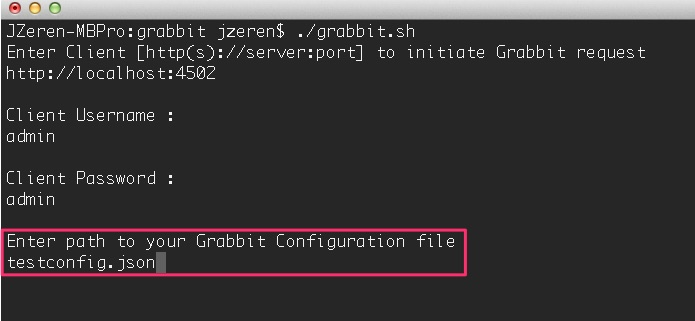
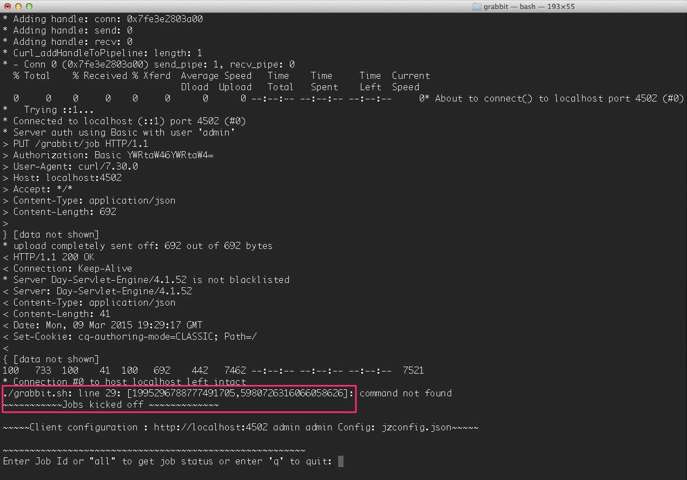
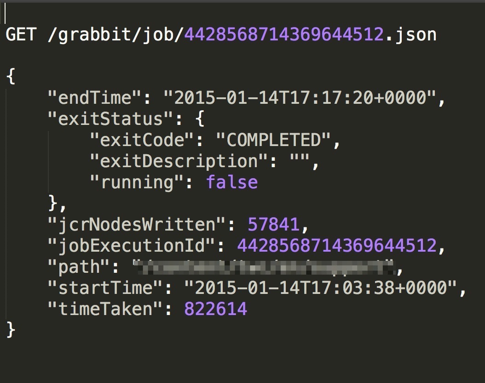

[](https://travis-ci.org/TWCable/grabbit)

[  ](https://bintray.com/twcable/aem/Grabbit/_latestVersion)

# Purpose #

The purpose of Grabbit is to provide a fast and reliable way of copying content from one Sling (specifically Adobe CQ/AEM) instance to another.

Existing solutions have been tried and found insufficient for very large data sets (GB-TB), especially over a network. CQ's .zip packages are extremely space inefficient, causing a lot of extra I/O. [`vlt rcp`](http://jackrabbit.apache.org/filevault/usage.html) and Mark Adamcin's [`recap`](http://adamcin.net/net.adamcin.recap/) use essentially the same mechanism: WebDAV using XML, doing an HTTP handshake for every node and many sets of properties, which means that any latency whatsoever on the network hurts performance enormously.
 
Grabbit creates a stream of data using [Google's Protocol Buffers](https://developers.google.com/protocol-buffers/) aka "ProtoBuf". Protocol Buffers are an extremely efficient (in terms of CPU, memory and wire size) binary protocol that includes compression. 

Moreover, by doing a continuous stream, we avoid the latency issues. Depending on the size and nature of the data, as well as network latency, we have so far seen speed improvements ranging from 2 to 10 times that of Recap/vlt. 

*__"Grabbit"__ obviously refers to this "grabbing" content from one CQ instance and copying it to another. However it also refers to "Jackrabbit," the reference JCR implementation that the content is being copied to and from.*
 
# AEM Support

Below details AEM version support for the various releases of Grabbit.  
```
v3.0.x - CQ 5.6
v2.0.1 - CQ 5.6
v2.0.0 - CQ 5.6
```

# Runtime Dependencies

* AEM/CQ v5.6.1
* To run Grabbit in your AEM/CQ instance, **you need to install a Fragment Bundle once per instance. It can be found [here](https://bintray.com/artifact/download/twcable/aem/dependencies/Sun-Misc-Fragment-Bundle-1.0.0.zip)**

# Building #

## Full Clean Build & Install ##

`gradlew clean build install refreshAllBundles` 

## Pre-requisites ##

### Installing Protocol Buffers Compiler ###

#### For Windows ####

Install the binary from https://github.com/google/protobuf/releases/download/v2.4.1/protoc-2.4.1-win32.zip and then set the `/path/to/protoc/parent` on your PATH variable.

#### For Macs ####

```

brew tap homebrew/versions

brew install protobuf241

brew link --force --overwrite protobuf241

```

_For both Windows and Mac : To verify that installation was successful, `protoc --version` should display `2.4.1`_

# Running Grabbit #

[This] (grabbit.sh) shell script can be used to initiate grabbit jobs for a given Grabbit configuration and to check the status of those jobs.

1. Create a configuration file with the path(s) you wish to copy (see "Config Format" section below, you'll also set the server side URL and credentials in this step)
2. Execute the grabbit.sh script (which comes with the codebase, by default lives in the root of the project)
3. Enter the full address for the client instance including port (details for the server instance should be in the config fil you create in step 1)
4. Enter Username for the client instance
5. Enter the Password for the client instance
6. Enter the path to the Grabbit config you created in step. Screenshot of how it will look like : 
7. Once the Grabbit content sync is kicked off, you will get a confirmation of the kicked off jobs like : 


### Config Format

A `json` configuration file of following format is used to configure Grabbit.

```json
{
    "serverUsername" : "<username>",
    "serverPassword" : "<password>",
    "serverHost" : "some.other.server",
    "serverPort" : "4502",
    "pathConfigurations" :  [
        {
            "path" : "/content/someContent",
        },
        {
            "path" : "/content/someContent",
            "excludePaths" :
            [
                "someOtherContent/someExcludeContent"
            ]
        },
        {
            "path" : "/content/dam/someDamContent",
            "excludePaths":
                [
                    "someContent/someExcludeContent",
                    "someContent/someOtherExcludeContent"
                ],
            "workflowConfigIds" :
                [
                    "/etc/workflow/launcher/config/update_asset_mod",
                    "/etc/workflow/launcher/config/update_asset_create",
                    "/etc/workflow/launcher/config/dam_xmp_nested_writeback",
                    "/etc/workflow/launcher/config/dam_xmp_writeback"
                ]
        }
    ]
}
```

#### Required fields

* __serverHost__: The server that the client should get its content from.
* __serverPort__: The port to connect to on the server that the client should use.
* __serverUsername__: The username the client should use to authenticate against the server.
* __serverPassword__: The password the client should use to authenticate against the server.
* __pathConfigurations__: The list of paths and their options to pull from the server.
    * __path__: The path to recursively grab content from.

#### Optional fields

Under "path configurations"

* __excludePaths__: This allows excluding specific subpaths from what will be retrieved from the parent path. See more detail below.
* __workflowConfigIds__: Before the client retrieves content for the path from the server, it will make sure that the specified workflows are disabled. They will be re-enabled when all content specifying that workflow has finished copying. (Grabbit handles the situation of multiple paths specifying "overlapping" workflows.) This is particularly useful for areas like the DAM where a number of relatively expensive workflows will just "redo" what is already being copied.
* __deleteBeforeWrite__: Before the client retrieves content, should the workspace identified by the path be cleared?  When used in combination with _excludePaths_, nodes indicated by _excludePaths_ will not be deleted

#### Exclude Paths

Exclude Paths allow the user to exclude a certain set of subpaths for a given path while grabbing content. They can only be __relative__ to the "path".

For example, let's say you have

```{ "path" : "/content/someContent" }```

and you would like to exclude ```/content/someContent/someOtherContent/pdfs```

Valid:

```
{
    "path" : "/content/someContent",
    "excludePaths" :
    [
        "someOtherContent/pdfs"
    ]
}
```

Invalid:

```
{
    "path" : "/content/someContent",
    "excludePaths" :
    [
        "/content/someContent/someOtherContent/pdfs",
        "/someOtherContent/pdfs",
        "./someOtherContent/pdfs"
    ]
}
```

# Monitoring / Validating the Content Sync #

You can validate / monitor sync by going to the following URI for each job on your Grabbit Client: 

`/grabbit/job/<jobId>.json`

This will give you the status of a particular job. It has the following format -

A job status is has the following format : 

```json
 {
       "endTime": "Timestamp",
       "exitStatus": {
           "exitCode": "Code",
           "exitDescription": "",
           "running": "true/false"
       },
       "jcrNodesWritten": "#OfNodes",
       "jobExecutionId": "JobExecutionId",
       "path": "currentPath",
       "startTime": "TimeStamp",
       "timeTaken": "TimeInMilliSeconds"
   }
```

Couple of points worth noting here:
`"exitCode"` : This can have 3 states - `UNKNOWN`, `COMPLETED`, `FAILED` 
    - `UNKNOWN` : Job is still running
    - `COMPLETED` : Job was completed successfully
    - `FAILED` : Job Failed
`"jcrNodesWritten"` : This indicates how many nodes are currently written (increments by 1000)
`"timeTaken"` : This will indicate the total time taken to complete content grab for `currentPath`

If `exitCode` returns as `UNKNOWN`, that means the job is still running and you should check for its status again.

__Sample of a real Grabbit Job status__



Two loggers are predefined for Grabbit. One for Grabbit Server and the other for Grabbit Client. 
They are [batch-server.log](grabbit/src/main/content/SLING-INF/content/apps/grabbit/config/org.apache.sling.commons.log.LogManager.factory.config-com.twcable.grabbit.server.batch.xml) and [batch-client.log](grabbit/src/main/content/SLING-INF/content/apps/grabbit/config/org.apache.sling.commons.log.LogManager.factory.config-com.twcable.grabbit.client.batch.xml) respectively.
These log files are for anything logged in **com.twcable.grabbit.server.batch** and **com.twcable.grabbit.client.batch** packages.

If you want to see what nodes are being written on the Grabbit Client, change the logging for `batch-client.log` above to `DEBUG` or `TRACE`.

# General Layout

There are two primary components to Grabbit: a client and a server that run in the two CQ instances that you want to copy to and from (respectively). The server has a GET Servlet to handle requests to grab data, and the client has a POST Servlet to manage starting jobs. Normally the client Servlet is used via a form, but can be called with "curl" or the like for scripted remote management.

A recommended systems layout style is to have all content from a production publisher copied down to a staging "data warehouse" (DW) server to which all lower environments (beta, continuous integration, developer workstations, etc.) will connect. That way minimal load is placed on Production, and additional DW machines can be added to scale out if needed, each of which can grab from the "main" DW.
The client sends an HTTP GET request with a content path and "last grab time" to the server and receives a ProtoBuf stream of all the content below it that has changed. The client's BasicAuth credentials are used to create the JCR Session, so the client can never see content they don't have explicit access to. There are a number of ways to tune how the client works, including specifying multiple focused paths, parallel or serial execution, JCR Session batch size (the number of nodes to cache before flushing to disk), etc.

# Library Attribution

* [Groovy v2.3.6](http://groovy.codehaus.org/Download)
* [Google Protocol Buffers v2.4.1](https://code.google.com/p/protobuf/downloads/list) - The compiler and runtime library is used for Serialization and De-serialization of Data
* [Spring Batch v2.2.7.RELEASE](http://docs.spring.io/spring-batch/2.2.x/downloads.html) - It is used on the server and client to read/write, marshal/unmarshall and send/receive the data to client in a controlled manner.
* [Jackalope v2.0.0](https://bintray.com/twcable/aem/jackalope/2.0.0/view) - Jackalope is used for testing
* [CQ Gradle Plugins v2.0.1](https://bintray.com/twcable/aem/cq-gradle-plugins/2.0.1/view) : They provide Gradle build support.
* [Gradle Protocol Buffers Plugin v0.9.1](http://search.maven.org/#artifactdetails%7Cws.antonov.gradle.plugins%7Cgradle-plugin-protobuf%7C0.9.1%7Cjar) - It provides easy integration of the ProtoBuf compiler with Gradle.

# LICENSE

Copyright 2015 Time Warner Cable, Inc.

Licensed under the Apache License, Version 2.0 (the "License"); you may not use this file except in compliance
with the License. You may obtain a copy of the License at

http://www.apache.org/licenses/LICENSE-2.0

Unless required by applicable law or agreed to in writing, software distributed under the License is distributed on
an "AS IS" BASIS, WITHOUT WARRANTIES OR CONDITIONS OF ANY KIND, either express or implied. See the License for
the specific language governing permissions and limitations under the License.
