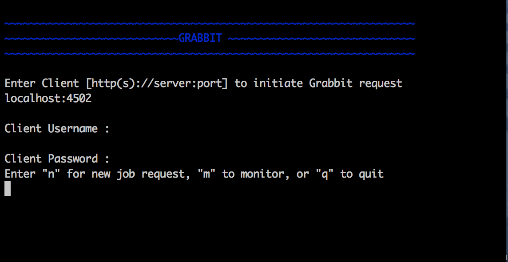
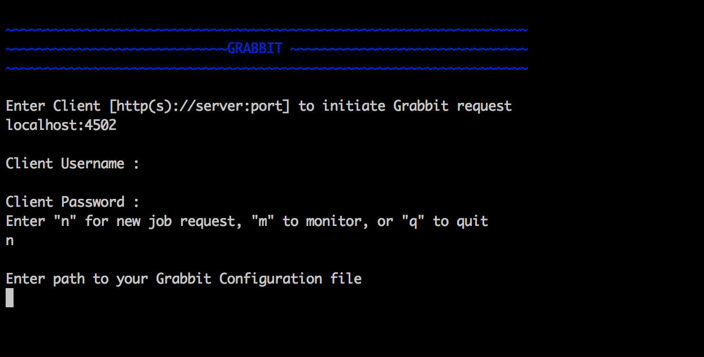
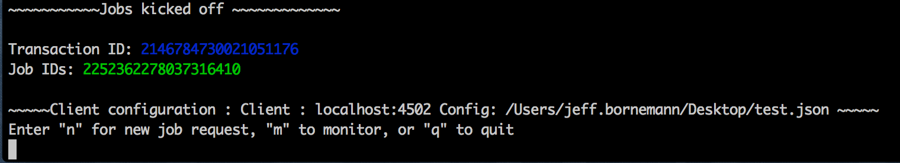
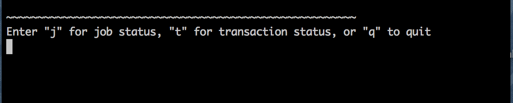

== Running

Make sure Grabbit Package is installed on both the server you are sending content from, and sending content to. You can download the package from image:https://api.bintray.com/packages/twcable/aem/Grabbit/images/download.svg[title = "Download", link = "https://bintray.com/twcable/aem/Grabbit/_latestVersion"]

Once that is done, you need just 2 files to sync content between the servers:

- link:../grabbit.sh[grabbit.sh]
- link:../sample-config.json[config.json] or link:../sample_config.yaml[config.yaml]

=== Getting Started With grabbit.sh

link:../grabbit.sh[This] shell script can be used to initiate new Grabbit jobs, or monitor existing jobs.

- Run grabbit.sh
- Enter connection details to your receiving server (The server you wish to pull content into)



=== Creating a New Job Request

From the main screen, enter "n" for a new request. Enter an absolute path (from the machine you are running grabbit.sh) to the Grabbit configuration file you wish to use for creating a new request.
See the "Configuration" section for details on how to create these configuration files.



After the job request is sent, and started you should see a confirmation screen with the job IDs of all the jobs started, as well as their transaction ID



=== Monitoring

From the main screen, enter "m" to monitor an existing job, or jobs. You will be prompted. If you would like to monitor a group of jobs by their transaction, enter "t". If you would like to monitor a specific jobs, enter "j".




See link:Monitoring.adoc[Monitoring / Validating the Content Sync] for information on evaluating the returned information.


==== Configuration

Configuration can be developed in both YAML, and JSON formats.

Here is an example `JSON` configuration file that could be used for configuring Grabbit:

```json
{
    "serverUsername" : "<username>",
    "serverPassword" : "<password>",
    "serverHost" : "some.other.server",
    "serverPort" : "4502",
    "batchSize" : 150,
    "deltaContent" : true,
    "pathConfigurations" :  [
        {
            "path" : "/content/someContent",
            "batchSize" : 50
        },
        {
            "path" : "/content/someContent",
            "batchSize" : 200,
            "excludePaths" :
            [
                "someOtherContent/someExcludeContent"
            ]
        },
        {
            "path" : "/content/dam/someDamContent",
            "excludePaths":
                [
                    "someContent/someExcludeContent",
                    "someContent/someOtherExcludeContent"
                ],
            "workflowConfigIds" :
                [
                    "/etc/workflow/launcher/config/update_asset_mod",
                    "/etc/workflow/launcher/config/update_asset_create",
                    "/etc/workflow/launcher/config/dam_xmp_nested_writeback",
                    "/etc/workflow/launcher/config/dam_xmp_writeback"
                ],
            "deltaContent" : false
        }
    ]
}
```
The corresponding `YAML` configuration for the JSON above will look something like:
```
   # Client Type: author

   # Information for connecting to the source content
   serverUsername : '<username>'
   serverPassword : '<password>'
   serverHost : some.other.server
   serverPort : 4502

   deltaContent : true # default for all the paths

   # A reference to the standard set of workflow configuration ids that
   # we want to turn off when working with DAM assets.
   &damWorkflows:
     - /etc/workflow/launcher/config/update_asset_mod
     - /etc/workflow/launcher/config/update_asset_create
     - /etc/workflow/launcher/config/dam_xmp_nested_writeback
     - /etc/workflow/launcher/config/dam_xmp_writeback


   # Each of the paths to include in the copy
   pathConfigurations :
     -
       path : /content/someContent
     -
       path : /content/someOtherContent
       excludePaths: [ someExcludeContent ]
     -
       path : /content/dam/someDamContent
       excludePaths :
         - someContent/someExcludeContent
         - someContent/someOtherExcludeContent
       workflowConfigIds : *damWorkflows
```
===== Required fields

* __serverHost__: The server host to pull content from.
* __serverPort__: Server port for host above.
* __serverUsername__: Username for sending server authentication.
* __serverPassword__: Password for sending server authentication.
* __pathConfigurations__: The list of paths and their options to pull from the server.
** __path__: The path to recursively grab content from.

===== Optional fields

* __serverScheme__: string. The protocol to use when securing a connection to the sending server. Supported options are `http` and `https`. Defaults to `http`.
* __deltaContent__: boolean, ```true``` syncs only 'delta' or changed content. Changed content is determined by comparing one of a number of date properties including jcr:lastModified, cq:lastModified, or jcr:created Date with the last successful Grabbit sync date. Nodes without any of previously mentioned date properties will always be synced even with deltaContent on, and if a node's data is changed without updating a date property (ie, from CRX/DE), the change will not be detected.  Most common throughput bottlenecks are usually handled by delta sync for cases such as large DAM trees; but if your case warrants a more fine tuned use of delta sync, you may consider adding mix:lastModified to nodes not usually considered for exclusion, such as extremely large unstructured trees. The deltaContent flag __only__ applies to changes made on the server - changes to the receiving environment will not be detected (and won't be overwritten if changes were made on the receiving path but not on the sending path).
* __batchSize__: integer. Used to specify the number of nodes in one batch, Defaults to 100.
* __deleteBeforeWrite__: boolean. Before the receiving server retrieves content, should content under each path be cleared? When used in combination with excludePaths, nodes indicated by excludePaths will not be deleted

Under path configurations

** __excludePaths__: This allows excluding specific subpaths from what will be retrieved from the parent path. See more detail below.
** __workflowConfigIds__: Before the receiving server retrieves content for the path from the server, it will make sure that the specified workflows are disabled. They will be re-enabled when all content specifying that workflow has finished copying. (Grabbit handles the situation of multiple paths specifying "overlapping" workflows.) This is particularly useful for areas like the DAM where a number of relatively expensive workflows will just "redo" what is already being copied.
** __deleteBeforeWrite__: Individual path overwrite for global deleteBeforeWrite setting.
** __deltaContent__: boolean. Individual path overwrite for the global deltaContent setting. Functionality is the same, but on a path-by-path basis, instead of applying to all path configurations. No matter what the global setting is, specifying this field will overwrite it. If not specified, the path will sync according to the global setting.
** __batchSize__: integer. Individual path override the global batchSize configuration. Functionality is the same, but on path-by-path basis. No matter what the global setting is, specifying this field will overwrite it. If not specified, the path will sync according to the global setting.


===== Exclude Paths

Exclude Paths allow the user to exclude a certain set of subpaths for a given path while grabbing content. They can only be __relative__ to the "path".

For example, let's say you have

```json
 { "path" : "/content/someContent" }
```

and you would like to exclude ```/content/someContent/someOtherContent/pdfs```

Valid:

```json
   {
       "path" : "/content/someContent",
       "excludePaths" :
       [
           "someOtherContent/pdfs"
       ]
   }
```

Invalid:

```json
   {
       "path" : "/content/someContent",
       "excludePaths" :
       [
           "/content/someContent/someOtherContent/pdfs",
           "/someOtherContent/pdfs",
           "./someOtherContent/pdfs"
       ]
   }
```
